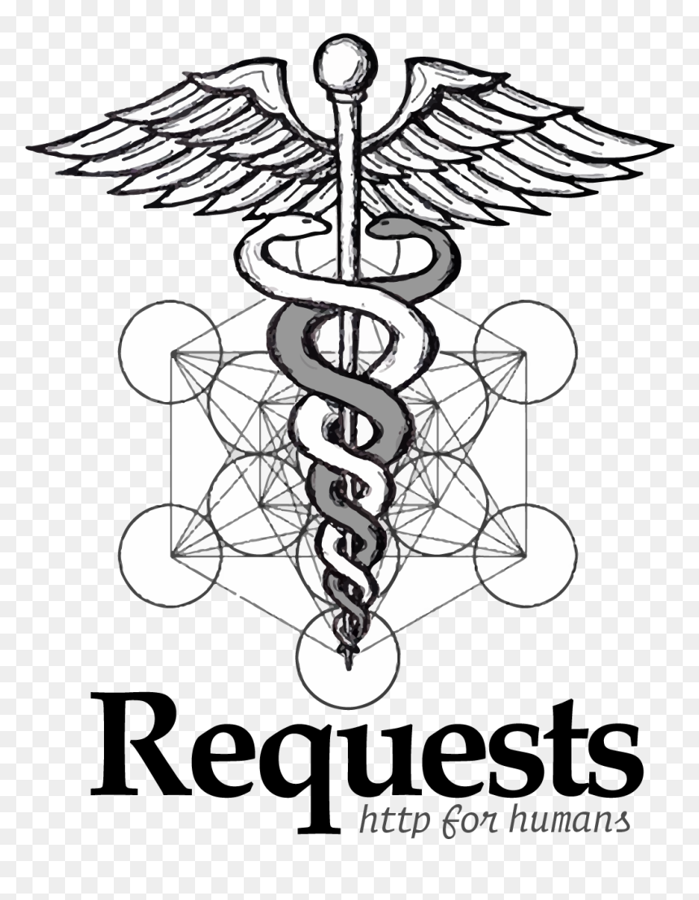
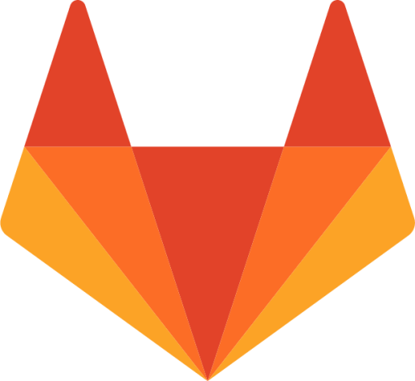
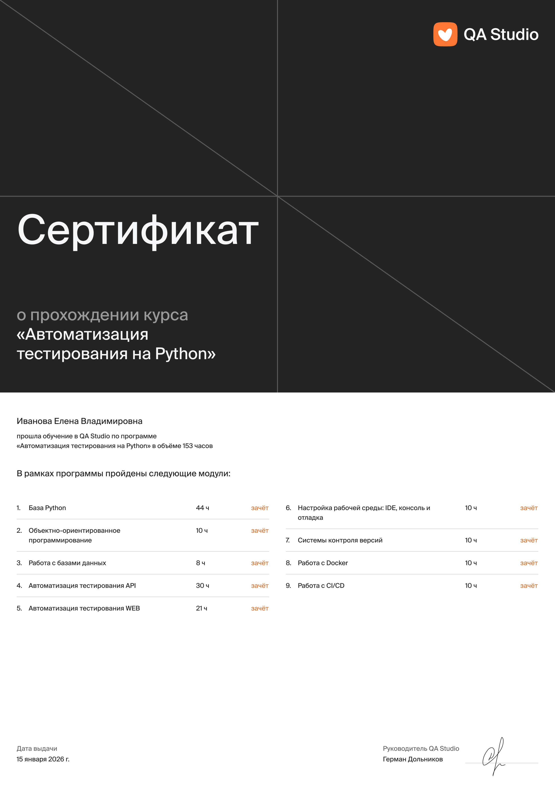
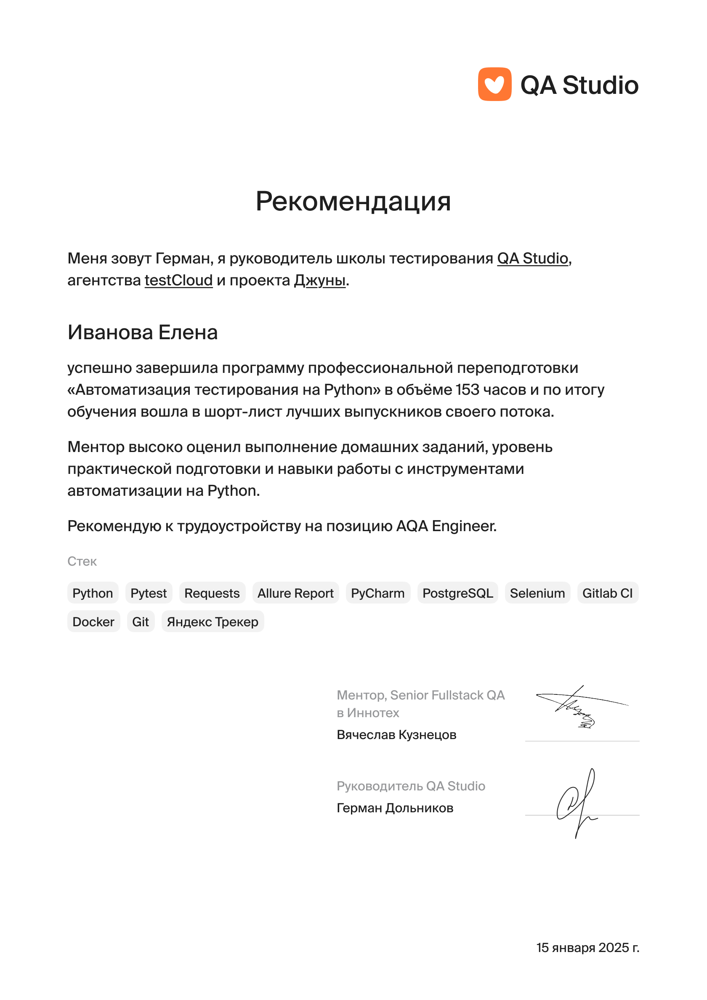

## Всем привет, я Игорь 👋
##### Junior QA в QUGO 🧡

* 🔥 1+ лет в тестировании
* 🐍 Пишу автотесты на Python
* ⚙️ Развиваюсь в автоматизации

  

### Python QA Auto

#### Мой стек:
| Python | PyCharm | Git | Pytest | Requests | Selenium | Allure Report | Docker | Gitlab CI |
|--------|---------|-----|--------|----------|----------|---------------|--------|-----------|
|   |   || |  | | | | |

#### Мои проекты:
| API My Shows Rating |  API Битва покемонов | UI Битва покемонов |
|---------------------|----------------------|--------------------|
|[myshows-api-tests](https://github.com/ваш-профиль/myshows-api-tests)|[pokemonbattle-api-tests](https://github.com/ваш-профиль/pokemonbattle-api-tests)   | [pokemonbattle-e2e-tests](https://github.com/ваш-профиль/pokemonbattle-e2e-tests)   
| Pytest, Requests, Docker|Pytest, Requests, Gitlab CI| Selenium, Gitlab CI|

### 📚 Обучение
|||

<!-- Выбор темы ↑↑: https://github.com/anuraghazra/github-readme-stats/blob/master/themes/README.md --> 
<!-- Настройка отображения ↑↑: https://github.com/anuraghazra/github-readme-stats/ --> 

<!-- Выбор темы ↑↑: https://github.com/Ashutosh00710/github-readme-activity-graph/blob/main/THEMES.md --> 
<!--
**elenaivanovaqa/elenaivanovaqa** is a ✨ _special_ ✨ repository because its `README.md` (this file) appears on your GitHub profile.

Here are some ideas to get you started:

- 🔭 I’m currently working on ...
- 🌱 I’m currently learning ...
- 👯 I’m looking to collaborate on ...
- 🤔 I’m looking for help with ...
- 💬 Ask me about ...
- 📫 How to reach me: ...
- 😄 Pronouns: ...
- ⚡ Fun fact: ...
-->
